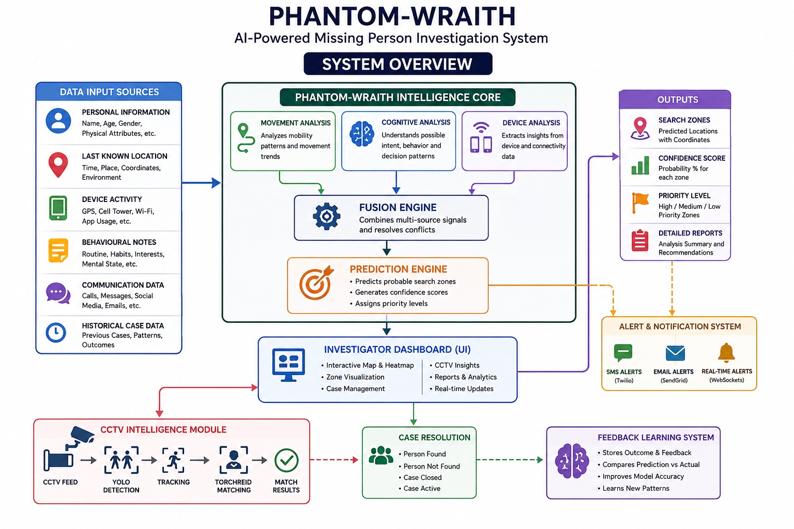
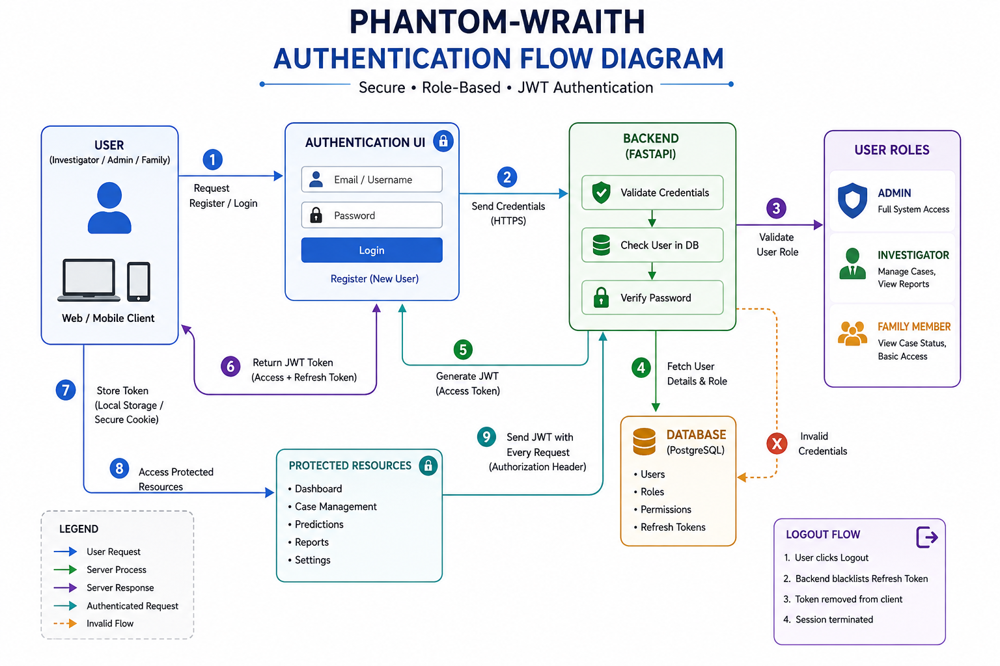
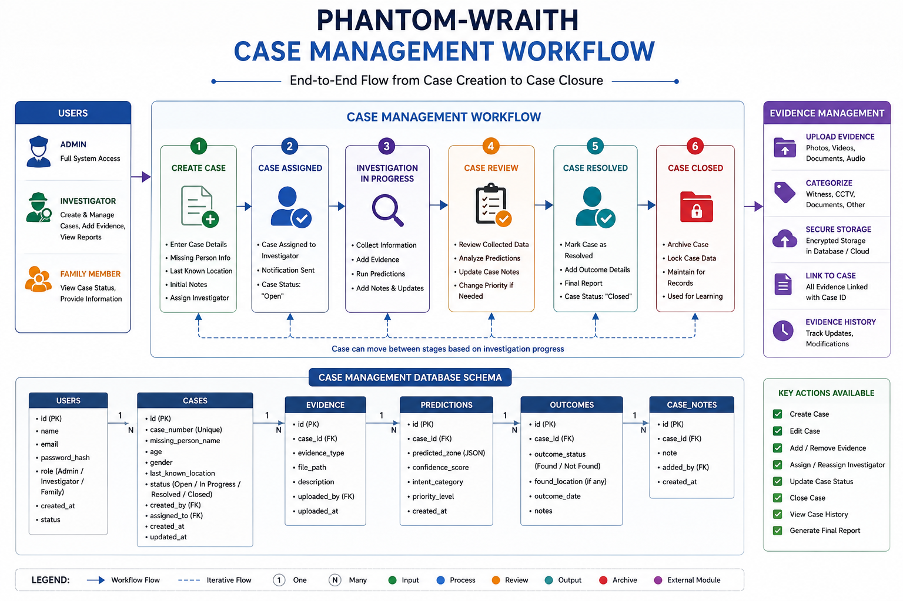
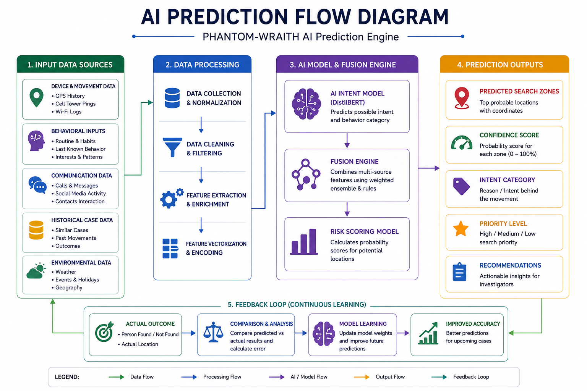
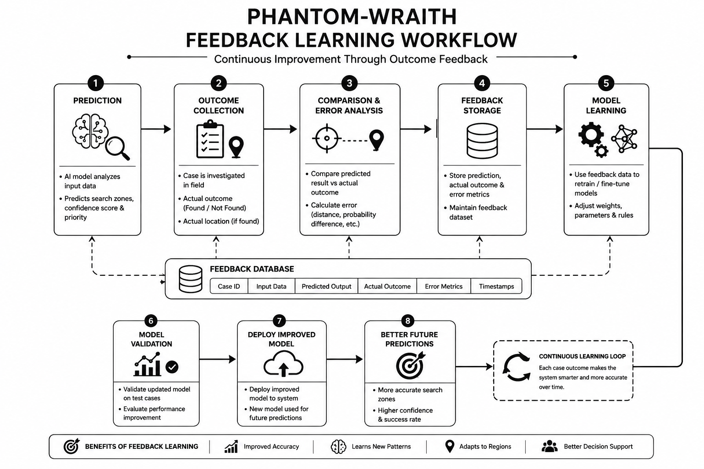

# PHANTOM-WRAITH  
## Ultimate Development Blueprint

**Project Deadline: 09 June 2026**

---

## Project Overview

PHANTOM-WRAITH is an AI-powered Missing Person Investigation System that predicts the probable location of a missing person using behavioural patterns, movement analysis, device activity, and CCTV intelligence. The project is designed to assist investigators by generating search zones, confidence scores, and case-based recommendations.



---

## Core Objectives

| Objective | Description |
|---|---|
| Predict Search Zones | Generate likely locations of missing persons |
| Reduce Search Time | Help investigators prioritize areas |
| CCTV Intelligence | Match individuals from surveillance footage |
| Continuous Learning | Improve predictions from solved cases |
| Real-Time Alerts | Notify investigators instantly |

---

## Team Development Timeline

| Phase | Module | Deadline | Status |
|---|---|---|---|
| Phase 1 | Infrastructure & Authentication | 03 June | Pending |
| Phase 2 | Case Management System | 04 June | Pending |
| Phase 3 | AI Prediction Engine | 05 June | Pending |
| Phase 4 | Heatmap & Mapping System | 06 June | Pending |
| Phase 5 | CCTV Intelligence Module | 07 June | Pending |
| Phase 6 | Notification System | 08 June | Pending |
| Phase 7 | Feedback Learning System | 08 June | Pending |
| Phase 8 | Testing & Deployment | 09 June | Pending |

---

## Technology Stack

| Layer | Technology |
|---|---|
| Frontend | React, Vite, Material UI |
| State Management | Redux Toolkit |
| Maps | Leaflet |
| Backend | FastAPI |
| Authentication | JWT |
| Database | PostgreSQL |
| AI/ML | DistilBERT, PyTorch |
| Computer Vision | YOLO, TorchReID |
| Notifications | Twilio, SendGrid |
| Deployment | Docker, Railway/AWS |

---

## Module Allocation

### Module 1 – Authentication

PHANTOM-WRAITH requires a secure login and role-based access system so that investigators, admins, and family members can access only the features meant for them.

| Feature | Description |
|---|---|
| Login | Investigator Login |
| Register | New User Registration |
| JWT Auth | Secure Authentication |
| Role Management | Admin, Investigator, Family |

**Deadline: 03 June**



---

### Module 2 – Case Management

The case management system will allow users to create, edit, delete, and close missing person cases. It will also store evidence and case-related notes.

| Feature | Description |
|---|---|
| Create Case | Add Missing Person Case |
| Edit Case | Update Information |
| Delete Case | Remove Invalid Cases |
| Close Case | Mark Resolved |
| Upload Evidence | Photos, Documents, Notes |

| Database Table | Purpose |
|---|---|
| Users | Store user account details |
| Cases | Store missing person case records |
| Evidence | Store uploaded files and notes |
| Predictions | Store AI prediction outputs |

**Deadline: 04 June**



---

### Module 3 – AI Prediction Engine

The AI engine predicts the most probable destination or search zone using movement patterns, device activity, communication traces, and historical case information.

| Input Source | Data |
|---|---|
| Device Activity | GPS, Cell Tower |
| Behaviour Notes | Investigator Inputs |
| Communication | Calls & Messages |
| Historical Data | Previous Cases |

| Output | Description |
|---|---|
| Search Zone | Predicted Area |
| Confidence Score | Prediction Confidence |
| Intent Category | Reason for Prediction |
| Priority Level | Search Priority |

**Deadline: 05 June**



---

### Module 4 – Heatmap Engine

The heatmap engine visualizes the likely movement area using probability-based zone expansion over time.

| Feature | Description |
|---|---|
| Zone Generation | Create Search Regions |
| Probability Heatmap | Visual Risk Map |
| Radius Expansion | Time-Based Growth |
| Multi-Zone Support | Multiple Search Areas |

| Zone | Probability |
|---|---|
| Zone A | 82% |
| Zone B | 64% |
| Zone C | 43% |

**Deadline: 06 June**

---

### Module 5 – CCTV Intelligence

The CCTV module will process surveillance footage and identify likely matches using object detection and re-identification methods.

| Step | Process |
|---|---|
| 1 | CCTV Video Input |
| 2 | YOLO Detection |
| 3 | Person Tracking |
| 4 | TorchReID Matching |
| 5 | Confidence Scoring |
| 6 | Alert Generation |

| Deliverable | Description |
|---|---|
| CCTV Dashboard | View processed footage and results |
| Person Detection | Detect individuals in video |
| Match Engine | Compare appearance embeddings |
| Match Reports | Show confidence-based match output |

**Deadline: 07 June**

---

### Module 6 – Notification System

The notification system ensures that critical updates are sent in real time through email, SMS, and dashboard alerts.

| Feature | Tool |
|---|---|
| SMS Alerts | Twilio |
| Email Alerts | SendGrid |
| Real-Time Alerts | WebSockets |

**Deadline: 08 June**

---

### Module 7 – Feedback Learning

The feedback system stores the actual outcome of a case and compares it against the prediction, helping improve future performance.

| Stage | Description |
|---|---|
| Prediction | System Prediction |
| Outcome | Actual Found Location |
| Comparison | Error Analysis |
| Learning | Model Update |

| Benefit | Description |
|---|---|
| Better Future Predictions | Improves accuracy over time |
| Geography Learning | Learns region-specific patterns |
| Confidence Optimization | Refines scoring |
| Pattern Recognition | Detects repeated behavior patterns |

**Deadline: 08 June**



---

## Database Design

### Users

| Field | Type |
|---|---|
| id | UUID |
| name | String |
| email | String |
| password | String |
| role | String |

### Cases

| Field | Type |
|---|---|
| id | UUID |
| case_number | String |
| status | String |
| created_by | UUID |
| created_at | Timestamp |

### Predictions

| Field | Type |
|---|---|
| id | UUID |
| case_id | UUID |
| predicted_zone | JSON |
| confidence | Float |

### CCTV Matches

| Field | Type |
|---|---|
| id | UUID |
| case_id | UUID |
| camera_id | String |
| confidence | Float |

---

## Repository Structure

```text
phantom-wraith/

├── frontend/
├── backend/
├── ai-engine/
│   ├── intent-model/
│   ├── fusion-engine/
│   ├── heatmap-engine/
│   └── training/
│
├── cctv-engine/
│   ├── yolo/
│   ├── reid/
│   └── tracking/
│
├── docs/
├── docker/
└── README.md